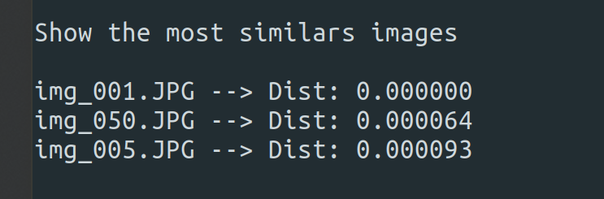
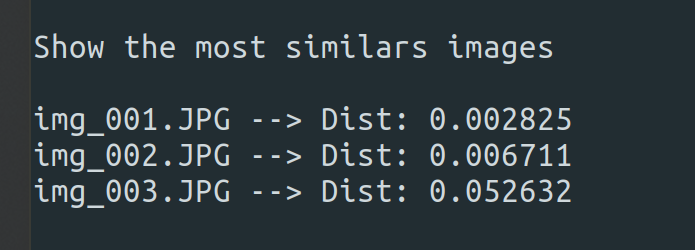
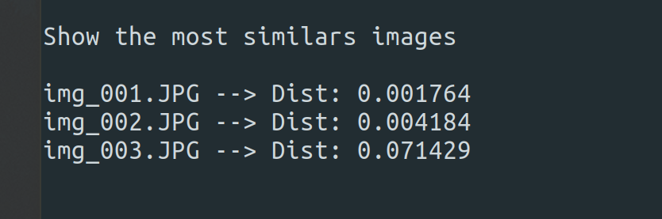

# Image Retrieval
Implementation of a CBIR in C++

## How to Run
To compile use:
    
    cmake .

And to run:
    
    ./image_retrieval   <num_image_between_01_and_56>

Then:\
     1) For color histogram distance\
     2) For shape distance\
     3) For ORB descriptors distance\
     4) For SIFT descriptors distance

## Results
Results with image 01:

1) Color histogram\

2) Shapes\

3) ORB descriptors\

4) SIFT descriptors\

